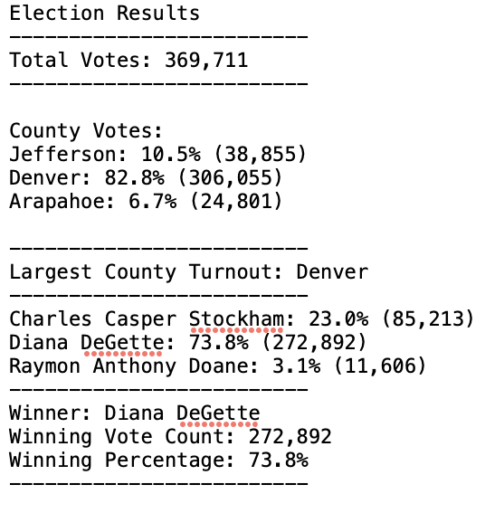

# Election_Analysis
Columbia Data Analysis Bootcamp challenge to analyze election data using Python

## Overview of Election Audit
This congressional election audit seeks to count all of the votes in order to confirm the winning candidate as well as the number and percentage of votes won by each candidate. The audit will also demonstrate how much of the vote came from each of the counties in the district.

## Election Audit Results
As illustrated in the text file pasted below:
### A total of 369,711 votes were cast in this congressional election.
### The largest number of votes were cast in Denver.
#### * Election results, listed by location:

           1. Denver County cast 82.8% or 306,055 votes.
           2. Jefferson County cast 10.5% or 38,855 votes.
           3. Arapahoe County cast 6.7% or 24,801 votes.

### Outcome: 
### Diana DeGette won the election with nearly 74% of the vote (272,892 votes)
#### * Election results, by candidate:
           1. Diana DeGette received 73.8% or 272,892 votes.
           2. Charles Casper Stockham received 23.0% or 85,213 votes.
           3. Raymon Anthony Doane received 3.1% or 11,606 votes.

 

## Election-Audit Summary

Proposed improvements for future audits: 
##### By incorporating minor changes in the code this Python script can be adjusted to report the percentage of voters in each county the supported each candidate. Building on this data the code could output a ranking of which counties show the strongest and weakest support for each candidate. 